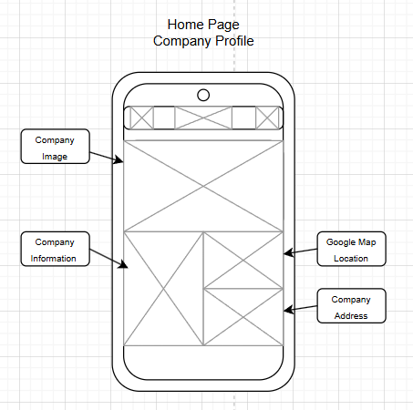

# Unit 15: Website Development - Assignment 2 - P110102211
## Design and Develop a Website

P110102211 - Cory Callicott

## Introduction
Context: I have been asked
as part of your induction and training to create a new section
for the company’s web site which promotes the company to
prospective employees, as they need to recruit more web
developers. The company wants you to include the following
things:
● A profile of the company itself
● profiles of existing trainee web developers
● job specifications and required qualifications
● an on-line application form
● links to web development courses
The target audience for the site is people who have
completed training courses or qualifications related to web
development and are now looking for a job as a web
developer.

-[P2](#p2---produce-designs-for-a-website-that-meet-client-requirements)
-[P3](#p3---review-the-website-design-proposals-with-others-to-identify-and-inform-improvements)
-[P4](#p4---produce-a-websute-for-an-intended-audience-and-purpose)
-[P5](#p5---test-the-website-for-functionality-compatibility-and-purpose)
-[P6](#p6---review-the-extent-to-which-the-website-meets-client-requirements)
-[M2](#m2-justify-the-design-decisions-explaining-how-they-will-meet-the-users-needs-and-be-fit-for-purpose)
-[M3](#m3---optimise-a-website-to-meet-client-requirements)

# P2 - Produce designs for a website that meet client requirements.

## Aims, Goals, and Target Audience of the Website

Within the brief, I have been requested to produce a website section that helps the company promote themselves to new trainees as a part of a recruitment process. As part of the website development I have been tasked with producing a website that includes the following:

    1. A profile of the company itself, which would include a brief summary of the company, company image and address location.

    2. Profiles of trainees within the company, this includes their profile picture and brief description of who they are and what they do.

    3. Job specifications that highlight the potential work they will be partaking within the company, as well as, the required             qualifications to be eligible for hire.

    4. Page dedicated to online applications

    5. Links to free and premium web development courses.

Analysing the passage above, I have summarised the clients needs and how I can successfully meet these requirements.
The first overall client requirement is to produce a functioning website that can be used by potential clients and recruits looking for work within the web development environment. To meet this requirement I will need to produce a website that does the following:

    1. Navigates between different pages of the website

    2. Allows the user to view the following pages; home page, existing team members, company profile information, job specification and required qualifications, and online form, and additional courses for web development.

    3. Allow the users to enter and send an online application form to the company through the website.

    4. Generally advertise the company to potential new hires.

The second overall client requirement is to ensure the website clearly states the minimum recruitment requirements as to ensure that only web developers (trainees and entry-level) are permitted to apply for trainee positions.

## Colour Schemes and Typography Choices

Within my plans for the website I had decided to use a blend/gradient of the colour green and black due to the compatibility and smooth blending between the colour choices and the company logo. The combination of the colours and the logo are pleasing to the eye and enact a sense of professionalism from the company website.

Another choice I made was to ensure that the text fonts and sizes used are both easy-to-read for everyone, including users with a form of accessibility needs or visual issues. They are able to stay engaged with the website for longer without eye-strain or loss-of-engagement.

I decided within my mockups to use a large image in the form of a banner to display the company building within the homepage. The reason for this choice is for transparency. Displaying the company building, with the direct google imaging allows for users with visual impairments to see the company building and the location they are based. This aids in directions to the company building and helps with navigation if they are to apply and attend the company building.

I made use of adding a white box to most text and images within the website as to enhance the focus points on the website. This both aids in improving engagement towards the text/information as well as help with users with visual impairments.

## Wireframes

To aid with designing my website, I used wireframing. This allowed me to create a starting point for my website I am designing. 

Using wireframes create a clear and simply picture of how I intend the website to look. Though with assumptions that the wireframes would likely not be the final product, I still intended to use the wireframing to better represent my design choices.

I decided to do 2 variations of wireframing, one version to represent the computer-viewed website, and the other to display the mobile device-viewed website.

### Mobile Wireframing

For the mobile device version, I prioritised linear, simple designs that allowed the user to view almost all content by simply scrolling down and navigating to another page through the navigation bar on the top of the screen. 

### Home Page (Mobile)

### Staff Page (Mobile)

### Job Specification Page (Mobile)

### Online Application Page (Mobile)

# P3 - Review the Website Design Proposals with Others to Identify and Inform Improvements

# P4 - Produce A Websute for an Intended Audience and Purpose

# P5 - Test the Website for Functionality, Compatibility, and Purpose

# P6 - Review the Extent to Which the Website meets Client Requirements

# M2 Justify the Design Decisions, Explaining How They Will Meet the User's Needs and be Fit-for-Purpose.

# M3 - Optimise a Website to Meet Client Requirements